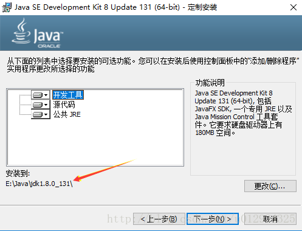
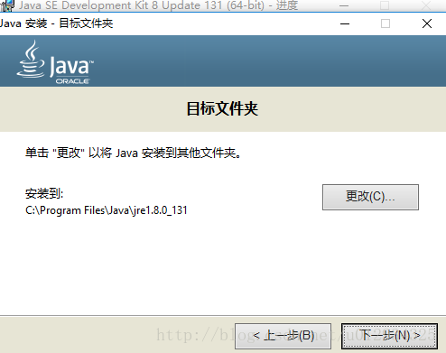
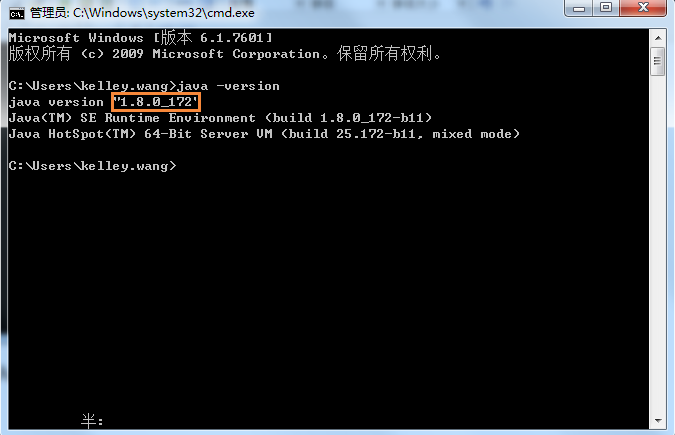

## 详细步骤
### 1、JDK下载地址
http://www.oracle.com/technetwork/java/javase/downloads/index.html

点开链接后选择如下下载按钮（选择的是jdk1.8的，也可以选择更高版本的，温馨提醒：最好创建一个Oracle账号，以便以后使用）：

    

### 2、点击上图中的链接，会出现下面的这个界面，此时你需要根据你的电脑系统来进行对应的版本进行选择（下面选择的是windows64位的），具体界面如下图所示：

    

### 3、下载之后，双击以后进行JDK的安装。安装界面如下（在下面第二幅图中可以修改一下安装路径）：

    
    
    
    

### 4、安装完成后，需要进行环境变量的配置，右键我的电脑—属性—-高级系统设置就会看到下面的界面

    

#### 1. 点击系统变量下面的新建按钮，变量名JAVA_HOME（代表你的JDK安装路径），值对应的是你的JDK的安装路径。

    

#### 2. 继续在系统变量里面新建一个CLASSPATH变量，其变量值如下图所示（此处需要注意：最前面有一个英文状态下的小圆点）：

    

#### 3. 在你的系统变量里面找一个变量名是PATH的变量，需要在它的值域里面追加一段如下的代码：
        %JAVA_HOME%\bin;%JAVA_HOME%\jre\bin;

### 5、测试自己所配置的环境变量是否正确 

#### Windows + R键，输入cmd，进入命令行界面，输入java -version命令，可以出现如下图的提示，你可以看你安装的JDK版本。

    

